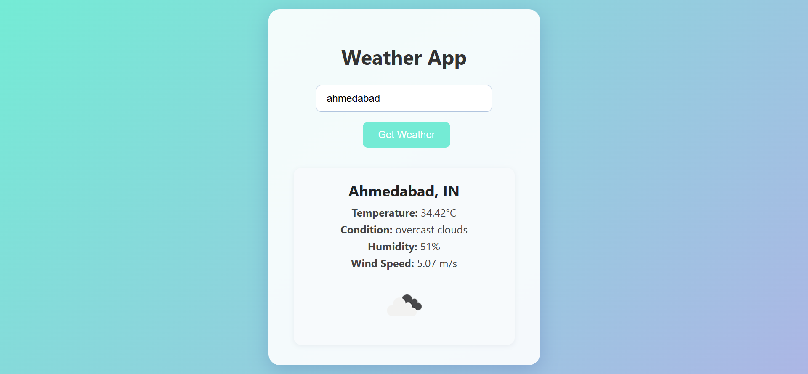

# 🌦️ Weather App :

A simple Weather Web App built using HTML, CSS, and JavaScript. It uses a free weather API to fetch real-time weather data for any city in the world.

## ✨ Features :

- 🌍 Search weather by city name
- 🌡️ Displays temperature, humidity, wind speed & weather condition
- 🕒 Shows current date and time
- 📱 Fully responsive design
  

## 🧰 Technologies Used :

- **HTML5** – Markup structure  
- **CSS3** – Custom styling  
- **JavaScript (ES6)** – App logic and interactivity  
- **Weather API** – (like OpenWeatherMap / WeatherAPI etc.)
  

 ## 📸 Project Preview :

